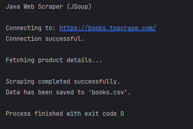

# Web Scraper - Java (JSoup)

## Internship Track
SkillCraft Technology - Software Engineering (Task 4)

## Description
A Java-based web scraping application that extracts product information such as title, price, and rating from a sample e-commerce website and stores the data in CSV format.

## Features
- Connects to website using JSoup
- Parses HTML content
- Extracts product details
- Saves structured data to CSV file
- Basic exception handling

## Technologies Used
- Java
- JSoup Library
- File Handling
- CSV Writing
- 
## Required Library

This project uses the Jsoup library for web scraping.

To run this project:

1. Download Jsoup jar from:
   https://jsoup.org/download

2. Add the jar file to your project classpath.

3. Compile using:
   javac -cp jsoup-1.15.3.jar WebScraper.java

4. Run using:
   java -cp .;jsoup-1.15.3.jar WebScraper
   
## How to Run
1. Add JSoup dependency to the project.
2. Compile:
   javac WebScraper.java
3. Run:
   java WebScraper

## Output
Generates a CSV file containing product information.

## Screenshot

## Learning Outcome
- HTML parsing
- Data extraction techniques
- Structured data storage
- Handling network-based operations
